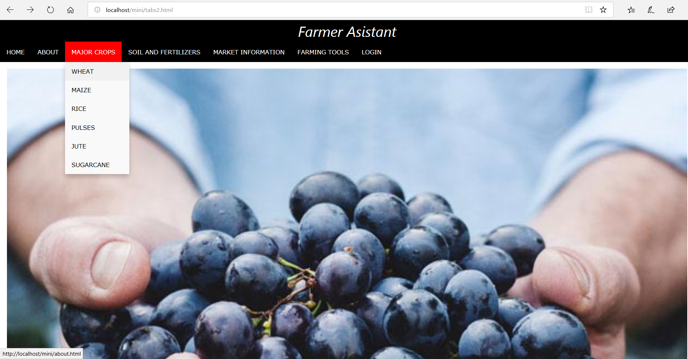
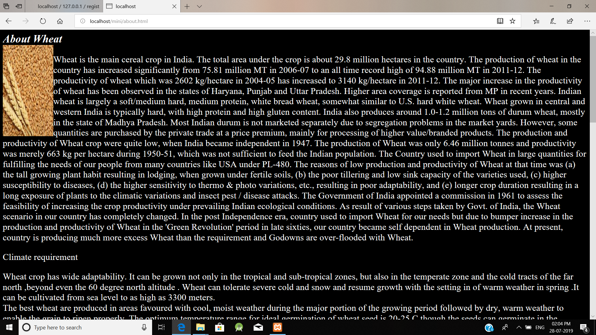
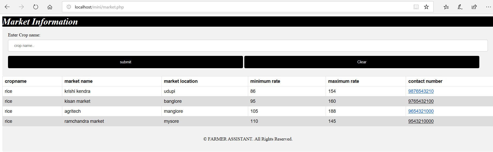

# Farmer-Assistant
Farmer Assistant System is a website which interacts  with Farmers  and influence Agriculture productivity in a variety of ways. It provides information and solution about crops, fertilizers, soil  to small farmers. Right now most of the small farmers do not have proper knowledge about market information, this system tries to provide information to farmers about their land,  market information. 

## Tools Used
Front End

* HTML
* PHP
* CSS

Back End

* Xamp Server For Database

## Getting Started

The Root file or Home Page is given by file `tabs2.html`

Farmer can acess information about crops using about crops section.

He can also get information about Soils and amount of Fertilizers to use for the crops and about suitable conditions in which the crops grows.

Farmer can acess market information ie he can get to know information about prices of his crops in different loactions using this feature.

## Additional Features

* Farming tools section provides information about operation of various farming tools
* Farmer Login section also allows farmers to ask questions and obtain feedback from the user anything  related  to agriculture.
* He can also keep record of Land Information ie the land he owns in different locations. 
